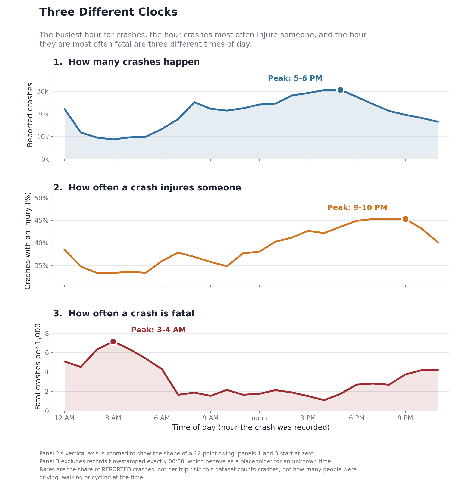

# Three Different Clocks

### When New York City crashes happen, when they injure, and when they kill — and why those are three different times of day

A reproducible analysis of 487,914 police-reported motor-vehicle collisions in New York City, 2021–2025.



---

## 1. Project Overview

Most people carry a rough mental model of road danger: rush hour is chaos, and the small hours are when things get deadly. This project tests that model against five complete years of NYC's own collision records.

It turns out both halves of the intuition are half right, and the interesting part is *how* they come apart. The hour with the most crashes, the hour when a reported crash is most likely to injure someone, and the hour when a reported crash is most likely to kill someone are **three different times of day**. Which one looks "most dangerous" depends on the outcome being measured.

The project is built as a script pipeline, not a notebook, so the whole analysis regenerates from a single documented sequence of commands.

## 2. Research Question

> **Are the times with the most reported crashes also the times when crashes are most likely to involve injuries?**

Plus the question that the data forced us to add:

> **Does the answer change when "severity" means *death* instead of *injury*?**

It does — almost completely.

## 3. Why This Matters

Crash *counts* are what get reported and what tend to drive attention. But a count answers "where is the traffic?" at least as much as "where is the harm?". If the hours that produce the most collisions are not the hours that produce the most serious outcomes, then counting collisions is a poor guide to where attention should go. Separating *how often* something happens from *how bad it is when it happens* is the whole point of this analysis, and it is a distinction that generalises well beyond traffic.

## 4. Dataset

**Motor Vehicle Collisions – Crashes**, NYC Open Data / NYPD.
One row per reported collision, from the MV-104AN police report.

| | |
|---|---|
| Rows analysed | **487,914** |
| Columns (raw) | 29 |
| Date range | 2021-01-01 → 2025-12-31 |
| Injury crashes | 195,275 (40.0%) |
| Fatal crashes | 1,304 (2.67 per 1,000) |
| Rows dropped in cleaning | **0** |

## 5. Data Source / Citation

New York City Police Department. *Motor Vehicle Collisions – Crashes.* NYC Open Data. Dataset `h9gi-nx95`.
<https://data.cityofnewyork.us/Public-Safety/Motor-Vehicle-Collisions-Crashes/h9gi-nx95>

Retrieved through the official Socrata API (not a third-party mirror). `src/download_data.py` writes a sidecar `.meta.json` recording the exact query, the retrieval timestamp and the row count, because this dataset is updated continuously — an analysis is only reproducible if you know which vintage it was built on.

## 6. Time Period

**Complete calendar years 2021–2025 only.** The year filter is applied server-side in the API query.

2026 is excluded deliberately: the published data end partway through 2026, and including a partial year would distort every seasonal and annual comparison.

## 7. Key Variables

Source columns used:

| Column | Note |
|---|---|
| `crash_date`, `crash_time` | Date and free-text `H:MM` time, combined into a timestamp |
| `number_of_persons_injured` / `_killed` | Primary outcome measures |
| `number_of_pedestrians_injured` / `_killed` | Road-user casualties |
| `number_of_cyclist_injured` / `_killed` | **singular** "cyclist" |
| `number_of_motorist_injured` / `_killed` | **singular** "motorist" |
| `borough`, `latitude`, `longitude` | Supporting only — heavily missing |
| `contributing_factor_vehicle_1` | Recorded classification, **not** an established cause |
| `vehicle_type_code1` | **no underscore** before the 1 |

### Schema differences found

The published API field names differ from the obvious guesses. These are documented in `src/preprocess.py` (`SCHEMA_NOTES`) and worth knowing before anyone writes `df.number_of_cyclists_injured`:

- `number_of_cyclist_injured`, not `cyclists`
- `number_of_motorist_injured`, not `motorists`
- `vehicle_type_code1`, but `vehicle_type_code_3` / `_4` / `_5`
- there is no datetime column; time of day lives entirely in the text field `crash_time`

## 8. Feature Engineering

All derived columns are defined once, in `src/features.py`.

**Temporal:** `year`, `month`, `month_name`, `crash_hour`, `crash_minute`, `day_of_week`, `day_name`, `is_weekend`, `week_part`, `time_period`.

**Time-of-day bands** — chosen to match how the city actually moves, not to cut the clock into equal pieces:

| Period | Hours |
|---|---|
| Late Night | 00:00–05:59 |
| Morning Commute | 06:00–09:59 |
| Daytime | 10:00–15:59 |
| Evening Commute | 16:00–19:59 |
| Night | 20:00–23:59 |

**Outcome flags** (all boolean):

```python
injury_crash                = number_of_persons_injured > 0
fatal_crash                 = number_of_persons_killed  > 0
pedestrian_injury_crash     = pedestrians injured or killed > 0
cyclist_injury_crash        = cyclist injured or killed > 0
motorist_injury_crash       = motorist injured or killed > 0
vulnerable_road_user_injury = pedestrian_injury_crash or cyclist_injury_crash
```

**Two conventions that shape every number downstream:**

1. Outcomes are booleans, not counts. The headline metric is the *share of crashes* that injured someone, so a crash that injured six people counts once, exactly like one that injured one. That keeps the metric a well-defined proportion.
2. **Road-user flags record who was *hurt*, not who was *present*.** The dataset has no road-user presence field. So every `pedestrian_injury_crash` is by construction also an `injury_crash`, which makes comparing injury *rates* between road-user flags circular. The project never does this; it compares shares of all reported crashes instead.

## 9. Analysis Workflow

```
download_data.py  ->  data/raw/nyc_crashes_2021_2025.csv     (API, server-side year filter)
preprocess.py     ->  data/processed/crashes_clean.parquet   (clean + features, 0 rows dropped)
analysis.py       ->  outputs/summary_tables/*.csv           (14 tables; 2 more come from preprocess.py)
                      outputs/analysis_summary.md            (the evidence base)
visualize.py      ->  figures/*.png + *.svg                  (5 figures)
```

Figures are rendered from the summary CSVs, never from the raw data, so a chart cannot disagree with the evidence base. Every number in `outputs/analysis_summary.md` is formatted from a computed value — none is typed by hand.

## 10. Key Findings

### The central finding: three clocks

| Question | Peak | Value |
|---|---|---|
| When do crashes happen most? | **5–6 PM** | 30,591 crashes |
| When is the injury share highest among reported crashes? | **9–10 PM** | 45.3% |
| When is the fatality rate highest among reported crashes? | **3–4 AM** | 7.14 per 1,000 |

**The hypothesis holds, but not in the expected direction.** Crash frequency and injury-crash rate do peak at different times — frequency at 5 PM, injury share about four hours later. But the quiet overnight hours are *not* when a crash is most likely to hurt someone; they are when it is **least** likely to (33.3% at 2–3 AM vs 45.3% at 9–10 PM).

The intuition about the small hours reappears only when the outcome changes. Among reported crashes, the fatality rate is **7.14 vs 1.08 per 1,000 — a 6.6× descriptive difference** between 3–4 AM and 4–5 PM. The per-hour 95% confidence intervals do not overlap, but the endpoints were selected from 24 hours; the broader overnight-versus-afternoon contrast is more defensible than treating one exact hour as uniquely dangerous.

So "severity" is not one thing. Ranked by injury share the overnight hours look safest; ranked by fatality rate they look worst. Both are true statements about the same crashes.

### By time period

| Period | Share of crashes | Injury-crash rate | Fatal per 1,000 |
|---|---:|---:|---:|
| Late Night | 14.7% | 35.2% | **5.02** |
| Morning Commute | 16.1% | 36.6% | 2.13 |
| Daytime | 30.7% | 39.4% | 1.83 |
| Evening Commute | 23.1% | **43.9%** | 2.02 |
| Night | 15.5% | 43.7% | 3.66 |

**Night (8 PM–midnight) is the one window where both measures are elevated together** — a high injury share *and* the second-highest fatality rate. It is the clearest single window where both measures point in the same direction.

### Supporting findings

- **The evening band holds across all seven days.** In the day × hour heatmap the dominant signal is horizontal (time of day), not vertical (day of week). All 168 cells have n ≥ 683, so none needed suppression.
- **Day of week matters far less than time of day** — 2.9 points between the highest and lowest day, against a 12-point swing across hours. Not a headline claim.
- **Weekday vs weekend repeats the inversion in miniature**: weekdays have the higher injury rate (40.5% vs 38.8%), weekends the higher fatality rate (3.04 vs 2.53 per 1,000).
- **Who gets hurt changes across the day.** Crashes injuring a pedestrian rise from 3.7% of crashes at 3–4 AM to 12.2% at 7–8 PM; cyclists from 1.8% to 7.4%.
- **About a quarter of the hourly injury swing is composition.** Setting aside every crash in which a pedestrian or cyclist was hurt, the remaining swing is 9.1 points instead of 12.0. So the evening peak is *both* a change in who is involved and a real shift within vehicle-occupant crashes — neither alone explains it.

Full evidence with confidence intervals and sample sizes: **[`outputs/analysis_summary.md`](outputs/analysis_summary.md)**.

## 11. Main Visualizations

| Figure | File |
|---|---|
| 1. When do NYC crashes happen? | [`figures/fig1_crashes_by_hour.png`](figures/fig1_crashes_by_hour.png) |
| 2. When is a crash most likely to hurt someone? | [`figures/fig2_injury_rate_by_hour.png`](figures/fig2_injury_rate_by_hour.png) |
| 3. **Three different clocks** (the central finding) | [`figures/fig3_three_clocks.png`](figures/fig3_three_clocks.png) |
| 4. The evening pattern holds every day of the week | [`figures/fig4_weekday_hour_heatmap.png`](figures/fig4_weekday_hour_heatmap.png) |
| 5. Evening crashes more often hurt someone outside a car | [`figures/fig5_road_user_by_hour.png`](figures/fig5_road_user_by_hour.png) |

Each is exported as PNG (200 dpi) and SVG, carries a plain-language title, units on the axes, and the denominator it was computed from.

## 12. Limitations and Ethical Considerations

**1. Reported crashes are not all crashes.** These are NYPD-reported collisions. New York requires a report for injury, death, or property damage above a threshold, so minor collisions are under-represented — probably unevenly across the day. Note the direction: if a harmless 3 AM fender-bender is *less* likely to be reported than the same crash at 3 PM, the overnight denominator shrinks and the overnight injury rate is pushed *up*. We observe the overnight injury rate as the lowest of the day **despite** that pressure, which makes the finding more robust, not less.

**2. There is no exposure denominator.** The dataset counts crashes, not trips, vehicle-miles, or people walking and cycling. Every rate here is conditional on a crash having been reported. Nothing in this project supports a claim like *"driving at 2 AM is more dangerous"* or *"cyclists are more likely to be hurt"* — we cannot compute those without knowing how many people were out there. The correct phrasing throughout is **"among reported crashes, a larger share involved…"**.

**3. Recorded contributing factor is not established cause.** The single most common value of `contributing_factor_vehicle_1` is `Unspecified` (24.7% of crashes), just ahead of `Driver Inattention/Distraction` (24.5%). These are administrative classifications entered by a reporting officer under time pressure, not investigated causes. No causal claim is made from them anywhere in this project.

**4. Missing data are not random.** `borough` is missing on **30.2%** of crashes — the largest single category, bigger than Brooklyn. Highway crashes disproportionately lack one. Coordinates are missing on 7.9%. This is why borough comparisons are supporting context only and never a ranking, and why there is no map.

**5. Timestamp quality — and a finding that came out of it.** `crash_time` is never null, but exactly `00:00` appears 8,527 times, roughly twice as often as any other single clock minute. Those records contain **1 fatal crash**. By comparison, each hourly bin from 1–6 AM contains 53–62 fatal crashes among 8,678–11,741 records — a similar-sized base. This unusually large difference strongly suggests that many exact-midnight timestamps are placeholders for an unknown time. They are **flagged, not dropped** (dropping 1.75% of data non-randomly costs more than it buys), and the figure showing fatality by hour excludes them and says so.

**6. Human impact.** Behind 1,304 fatal crashes are people and families. This analysis describes patterns in administrative records; it does not assign blame to individuals, and readers should not infer any. Fatality figures are reported as rates with their sample sizes rather than dramatised.

**7. Road-user flags are circular by construction** — see §8. The project compares shares of all reported crashes, never injury rates between road-user groups.

## 13. Reproduction Instructions

Requires Python 3.9+.

```bash
pip install -r requirements.txt
```

Then run the four steps in order:

```bash
python src/download_data.py
python src/preprocess.py
python src/analysis.py
python src/visualize.py
```

Run the automated unit tests before opening a pull request:

```bash
python -m unittest discover -s tests -v
```

The tests cover time-period boundaries, outcome flags, rate calculations,
timestamp parsing, casualty cleaning, and required-column validation. GitHub
Actions runs the same test suite automatically for every pull request.

Each script creates the directories it needs and is safe to re-run. `download_data.py` skips the download if the file already exists (use `--force` to refresh).

Expected outputs:

| Path | Contents |
|---|---|
| `data/raw/nyc_crashes_2021_2025.csv` | 487,914 rows, ~115 MB — **not committed**, see below |
| `data/raw/sample_nyc_crashes_1000.csv` | 1,000-row sample of the raw extract (**committed**) |
| `data/raw/nyc_crashes_2021_2025.csv.meta.json` | Query, retrieval timestamp, row count (**committed**) |
| `data/processed/crashes_clean.parquet` | 487,914 rows × 49 columns, ~23 MB (**committed**) |
| `outputs/summary_tables/*.csv` | 16 summary tables (14 from `analysis.py`, plus `missingness.csv` and `filter_ledger.csv` from `preprocess.py`) |
| `outputs/analysis_summary.md` | The evidence base |
| `figures/*.png`, `figures/*.svg` | 5 figures |

Useful options:

```bash
python src/download_data.py --start-year 2023 --end-year 2025 --force
python src/preprocess.py --start-year 2023 --end-year 2025
```

### A note on the data files

The **cleaned dataset is committed** (`data/processed/crashes_clean.parquet`, ~23 MB), so the analysis can be re-run and checked without touching the API.

The **full raw extract is not**, and cannot be: at ~115 MB it exceeds GitHub's 100 MB per-file hard limit. In its place the repository carries a real 1,000-row sample (`data/raw/sample_nyc_crashes_1000.csv`) so the raw schema is inspectable, the retrieval metadata, and a single command that reproduces the full file exactly. See [`data/raw/README.md`](data/raw/README.md).

## 14. Repository Structure

```text
.
├── README.md
├── requirements.txt
├── .gitignore
├── .github/
│   └── workflows/
│       └── tests.yml         # runs the unit tests on every pull request
│
├── data/
│   ├── raw/                  # 1,000-row sample + retrieval metadata
│   │                         # (full 115 MB extract is gitignored: over GitHub's limit)
│   └── processed/            # crashes_clean.parquet (committed, ~23 MB)
│
├── src/
│   ├── download_data.py      # Socrata API -> raw CSV, paginated and verified
│   ├── preprocess.py         # cleaning, filter ledger, missingness report
│   ├── features.py           # ALL derived columns + Wilson CI helper
│   ├── analysis.py           # summary tables + auto-written evidence base
│   └── visualize.py          # the 5 final figures
│
├── tests/
│   ├── test_features.py      # time periods, outcome flags, rates and CIs
│   └── test_preprocess.py    # timestamp parsing, casualty cleaning, schema checks
│
├── notebooks/
│   └── eda.ipynb             # exploration only; imports from src/, defines no logic
│
├── figures/                  # PNG + SVG
│
├── outputs/
│   ├── summary_tables/       # one CSV per question asked of the data
│   └── analysis_summary.md   # evidence base for the blog and slides
│
└── docs/
    ├── blog_final.md         # the published blog post
    ├── blog_draft.md
    └── presentation_outline.md
```

The notebook is for exploration only. Every piece of logic lives in `src/` and the notebook imports it, so there is no copy-pasted analysis code to drift out of sync.

## 15. Team Workflow / Git Collaboration

Nothing reaches `main` except through a reviewed pull request. `main` starts at
the project scaffolding and is built up one PR at a time:

| Branch | Scope | Merges into |
|---|---|---|
| `main` | Reviewed, working pipeline | — |
| `feature/data-preprocessing` | Acquisition, cleaning, feature engineering | `main` |
| `feature/eda-visualization` | Analysis, figures, write-ups | `main`, after the above |

The split follows the two halves of the pipeline: one branch is responsible for
producing a trustworthy dataset, the other for everything that reads from it.
They touch nearly disjoint file sets.

### Conventions

- **No direct pushes to `main`.** Every change arrives by PR.
- **Every PR states which commands were run** and what changed in
  `outputs/analysis_summary.md`. That file is the shared source of truth for
  every number in the README, the blog and the slides, so a diff in it is the
  fastest way to see whether a change moved a published figure.
- **Re-run the full pipeline before opening a PR.** Figures are rendered from
  the summary CSVs, so a stale figure is a review-catchable error rather than a
  silent one.
- **Review checklist:** does the pipeline run end to end from a clean checkout;
  does every rate in the diff carry its denominator; does any new claim in the
  prose match `outputs/analysis_summary.md`; and does any new wording imply
  per-trip risk, which this dataset cannot support (see §12).
