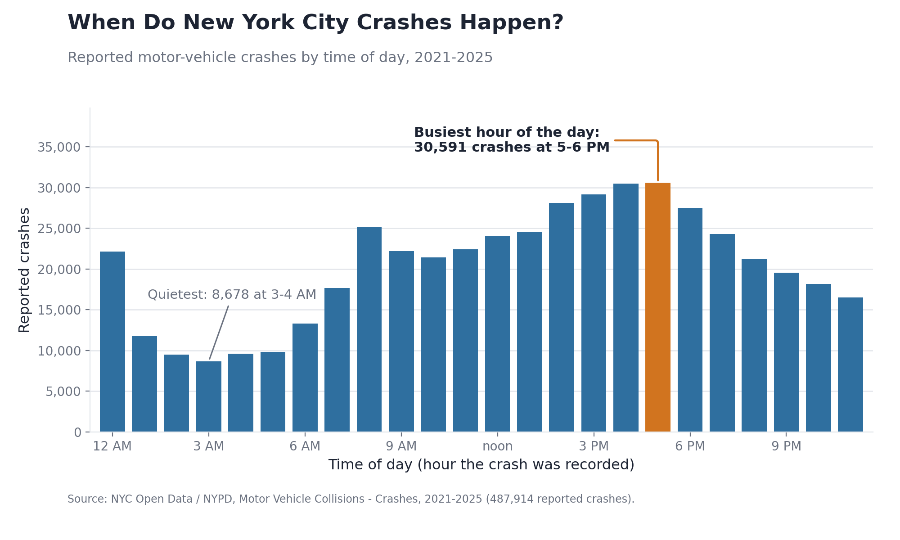
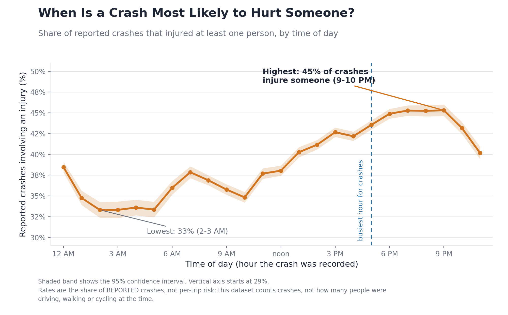
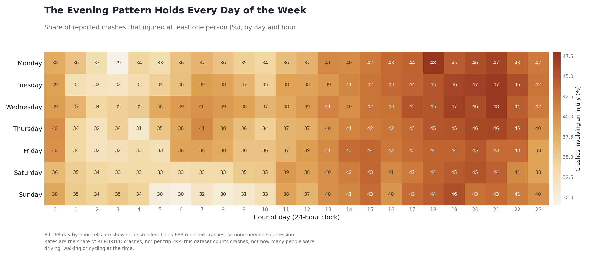
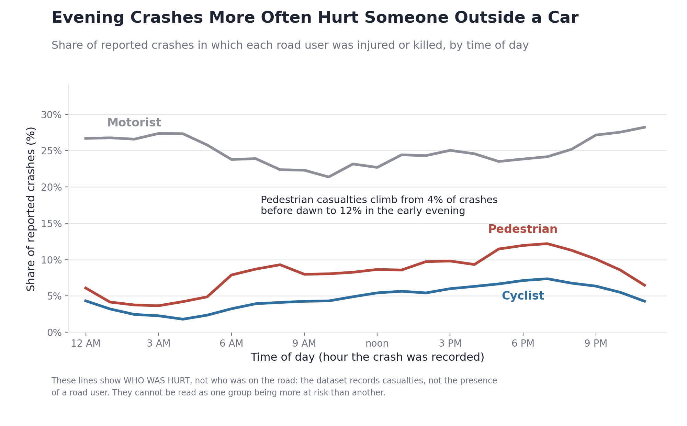

# Three Different Clocks: When Does New York City’s Crash Data Look Most Dangerous?

### One deceptively simple question about New York City’s reported crashes produces three different answers

When does New York City’s crash data look most dangerous—rush hour, late evening, or three in the morning?

Most people have one of two instincts. Rush hour seems like the obvious answer because the streets are crowded and collisions are frequent. But the early morning hours can also feel dangerous: roads are emptier, speeds may be higher, and the crashes that occur can be especially severe.

Both instincts capture something real. Neither tells the whole story.

After examining five complete years of New York City collision records, we found that the answer depends on what “dangerous” means. The hour with the most crashes, the hour when crashes most often injure someone, and the hour when crashes are most often fatal are three different times of day.

## Why this matters

For New Yorkers, road-safety advocates, and local decision-makers, crash counts are often the first signal that a particular time or place needs attention. That is reasonable—but a count measures how often something happens, not how much harm it causes.

One hundred minor collisions and five fatal collisions represent very different public-safety problems, even if both can be summarized using the word “dangerous.”

We therefore asked a more careful question:

> Are the times with the most reported crashes also the times when reported crashes cause the most serious harm?

## The data

New York City publishes records of motor-vehicle collisions reported to the NYPD. Each record includes when and approximately where a collision occurred, how many people were injured or killed, and whether those casualties were motorists, cyclists, or pedestrians.

We analyzed five complete calendar years, from 2021 through 2025:

- **487,914 reported crashes**
- **195,275 crashes that injured at least one person**
- **1,304 crashes involving at least one death**
- **261,634 people injured**
- **1,364 people killed**

We excluded 2026 because the available records covered only part of the year. Including an incomplete year would distort annual and seasonal comparisons.

Our main injury measure is the **share of reported crashes that injured at least one person**. This is not the number of people injured, and it is not the risk of taking a trip at a particular hour. It answers a narrower question:

> Given that a crash was reported, how often did it injure someone?

That denominator matters throughout the story.

## What we expected

We expected to find a simple contrast: crashes would pile up during rush hour, while late-night crashes would be more likely to injure someone.

The first half of that expectation was correct.

Reported collisions rise throughout the day and peak between **5 and 6 PM**, with **30,591 crashes** during that hour across the five-year period. The quietest hour, from 3 to 4 AM, contains only **8,678 crashes**.

At first, this looks like a familiar rush-hour pattern: reported collisions rise through the day and peak during the evening commute.

But the number of crashes is only one clock.

## The first surprise

Next, we calculated how often a reported crash injured at least one person.

The overnight hours were not the hours when crashes most often caused an injury. In fact, they were the hours when reported crashes were **least** likely to injure someone.

Between 2 and 3 AM, approximately **33%** of reported crashes injured at least one person—the lowest share of the day. The highest share appeared much later, between **9 and 10 PM**, when approximately **45%** of reported crashes injured someone.

The busiest hour and the hour with the highest injury share are about four hours apart:

- Most reported crashes: **5–6 PM**
- Highest injury share: **9–10 PM**

Crash frequency and injury severity follow different daily patterns.

But that was not the final reversal.

## What happens when “serious” means fatal?

If we change the outcome from “Did anyone get injured?” to “Did anyone die?”, the daily pattern flips again.

Among reported crashes, the fatality rate is highest overnight. From 3 to 4 AM, approximately **7.14 out of every 1,000 reported crashes** involved a death. From 4 to 5 PM—close to the busiest period of the day—the rate was approximately **1.08 per 1,000**.

That is a **6.6-fold descriptive difference**.

The city’s collision records therefore run on three different clocks:

- **Most crashes:** 5–6 PM
- **Highest injury share:** 9–10 PM
- **Highest fatality rate:** 3–4 AM

The early morning hours contain fewer reported crashes and the lowest injury shares, but they have the highest fatality rates. Rush hour contains many more collisions, but a comparatively low fatality rate.

“Dangerous” was never a single question.

Fatal crashes are rare, so we should be cautious about treating one exact hour as uniquely dangerous. The broader overnight-versus-afternoon contrast is more reliable than the ranking of any individual hour. Still, the difference is large enough to show why crash counts alone cannot describe the severity of the city’s collisions.

## The midnight that may not be midnight

Before trusting the overnight pattern, we also needed to determine whether the recorded times behaved sensibly.

One timestamp stood out.

Exactly `00:00` appears **8,527 times** in the dataset, but only one of those crashes was fatal. By comparison, each hourly group from 1 to 6 AM contains between **8,678 and 11,741 crashes** and between **53 and 62 fatal crashes**.

The number of crashes in these groups is similar, but the number of fatal crashes recorded at exactly midnight is dramatically different.

This does not prove that every `00:00` record is incorrect. However, it strongly suggests that many of these timestamps were used as placeholders when the precise crash time was unknown.

We did not delete these records. Instead, we flagged them and retained them in the overall dataset. We excluded them only from the fatality-by-hour calculation that they would otherwise distort.

This became an important part of the story: before interpreting a pattern, the data must first behave like the thing they claim to measure.

## The evening pattern is not just a weekend effect

The late-evening period also combines a relatively high injury share with an elevated fatality rate.

Could this pattern be caused only by weekends?

The day-by-hour results suggest otherwise.

Each row represents one day of the week, and each column represents an hour. The darker evening band appears across all seven days.

The difference across hours is also much larger than the difference across days. The injury share changes by approximately 12 percentage points across the hours of the day, compared with only about 2.9 points between the highest- and lowest-rate days.

Time of day appears to be the stronger descriptive pattern.

## Who is in the evening picture?

Part of what changes over the course of the day is who gets hurt.

Before dawn, fewer than 4% of reported crashes injure or kill a pedestrian. By early evening, that share rises to more than 12%. Crashes involving an injured or killed cyclist follow a similar pattern, rising from under 2% before dawn to more than 7% in the evening.

This does **not** mean that pedestrians or cyclists are individually more likely to be injured in the evening. The dataset records who was hurt, but it does not tell us how many motorists, cyclists, or pedestrians were using the roads at each hour.

The figure describes the composition of reported crashes—not the risk faced by each person traveling.

The changing mix of road users also explains only part of the evening increase. When we set aside crashes in which a pedestrian or cyclist was hurt, approximately three-quarters of the increase in the evening injury share remains.

The casualty mix contributes to the pattern, but it does not fully explain it. These records alone cannot tell us what causes the remainder.

## What the data cannot tell us

The most important limitation is that this dataset counts crashes, not exposure.

It does not count:

- The number of trips made at each hour
- The number of vehicles on the road
- Vehicle miles traveled
- The number of people walking or cycling
- Differences in speed, lighting, weather, or traffic conditions

As a result, we cannot conclude that driving at 3 AM is riskier than driving at 3 PM. We can only say that, **among crashes reported at those times**, different shares involved an injury or death.

The records also include only crashes reported to police. Minor collisions may go unreported, and reporting rates may change across the day.

In addition, the “contributing factor” in each crash report is an officer’s administrative classification, not necessarily a cause established through a complete investigation. The most frequent entry is “Unspecified,” so we do not use those fields to make causal claims.

Geographic comparisons present another limitation. Borough is missing for approximately 30% of the records, while coordinates are missing for about 8%. Because that missingness is unlikely to be random, we did not use a borough ranking or map as a headline result.

Finally, every fatality represents a person, a family, and a community—not simply a data point. The purpose of comparing these patterns is to understand the records more carefully, not to assign blame to individual road users.

## The takeaway

The most common hour for a reported crash in New York City is 5 PM. Among reported crashes, the injury share peaks around 9 PM, while the fatality rate peaks around 3 AM.

None of these findings contradicts the others. They answer three different questions that are often collapsed into one word: **dangerous**.

The broader lesson extends beyond traffic data. Before comparing how often something happens, we should ask what outcome is being measured and what population forms the denominator.

Sometimes the most valuable discovery is not a surprising number. It is realizing that the original question had more than one answer.

---

**Data source:** NYC Open Data / NYPD, *Motor Vehicle Collisions – Crashes*, 2021–2025.  
**Dataset:** https://data.cityofnewyork.us/resource/h9gi-nx95.csv  
**Analysis code and reproducibility materials:** https://github.com/Seiitsu77/AIPI510-Project1
